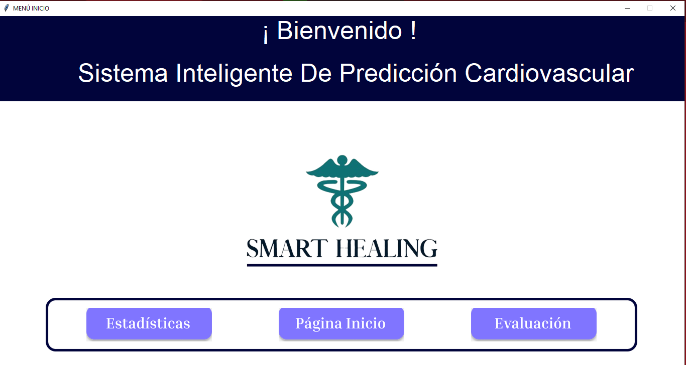
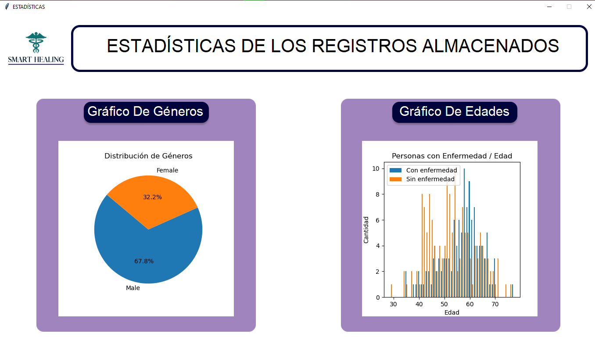
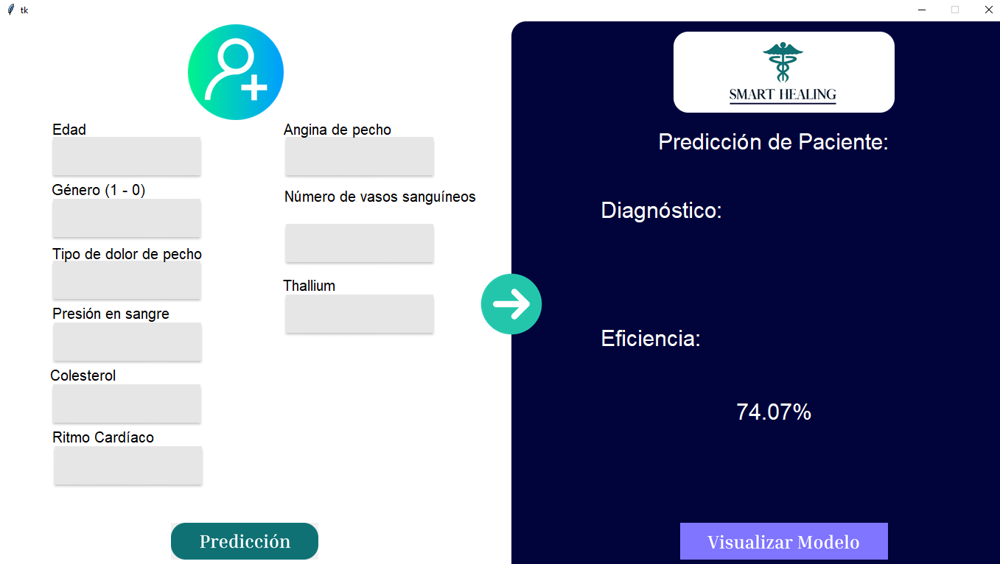
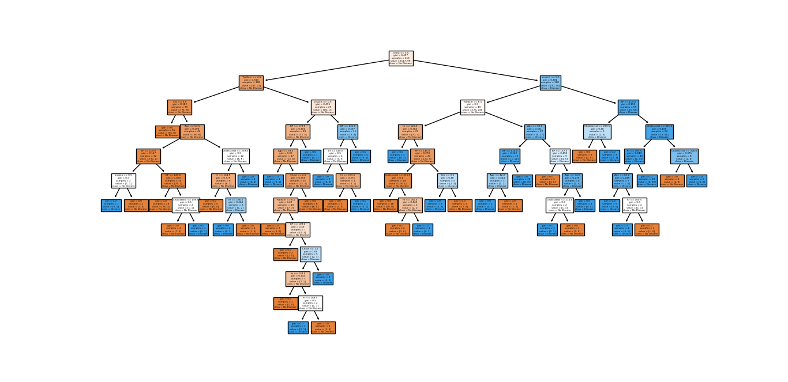

# Machine-Learning-Health-Prediction

The purpose of this project is to implement a prediction model using machine learning (decision tree).
The main idea is to gather characteristics of the user/patient to predict if the user is a candidate to suffer from any heart disease.

---
# Main Menu

# Estadistics

# Model

# Decision Tree

---
Dataset taken from kaggle.
> https://www.kaggle.com/datasets/thedevastator/predicting-heart-disease-risk-using-clinical-var
